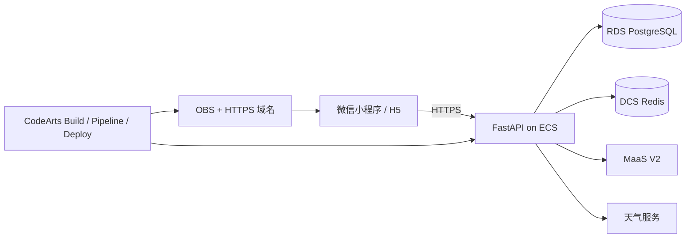

# 云循 YunSync

根据节气、天气、地域、轻微体感与现有食材，展示可追溯的养生饮食建议。首页支持一句话描述，食谱来自有来源与版本的审核库；模型只辅助理解和解释，过敏、禁忌及高风险提示由确定性规则处理。当前仓库的 12 道食谱均为 **DEMO**，不代表正式健康建议。

## 体验与状态

- **本地 H5**：`cd miniapp` → `npm ci` → `npm run dev:h5`。默认演示模式可以查看今日推荐、体感和食材匹配。
- **本地 API**：参见 [backend/README.md](backend/README.md)。可使用 SQLite/内存缓存离线开发，`/health` 会标记 `degraded`。
- **公网 Demo**：尚未上线。M14 的云端资源、MaaS、域名和 CodeArts Pipeline 仍需开通、配置及验收；不得把本地预览当成华为云上线证据。
- **部署手册**：[deploy/m14/README.md](deploy/m14/README.md)；[M14 验收记录](docs/competition/M14_ACCEPTANCE_RECORD.md)。

## 架构



RDS 保存食谱、来源和最小化审计；DCS 缓存天气与推荐并用于限流；MaaS 仅输出受控标签与说明；OBS 承载 H5；CodeArts Agent、项目 Skills、Build/Pipeline/Deploy 串联开发和发布。服务失败时推荐明确降级，敏感密钥只在后端安全变量中。

## 开发与验证

环境：Node.js、npm、Python 3.12；云端发布另需 Docker、Nginx、obsutil、华为云资源与 CodeArts 权限。依赖版本见 `miniapp/package-lock.json` 和 `backend/requirements.txt`。

```powershell
npm --prefix miniapp ci
node .codeartsdoer/skills/yunsync-validate/scripts/run-validation.mjs --full
.\.venv\Scripts\python.exe -m pytest backend/tests
```

Windows 上 Python 路径仅是已有虚拟环境示例；首次安装请先按 [后端说明](backend/README.md) 创建环境。H5 页面回归可使用 `run-validation.mjs --ui`。运行结果按实际时间记录在 [M14 验收记录](docs/competition/M14_ACCEPTANCE_RECORD.md)。

## 文档与开源

- [使用手册](docs/USER_MANUAL.md) · [项目计划书](docs/HUAWEI_CLOUD_M11_M14_PLAN.md) · [CodeArts 证据](docs/competition/CODEARTS_EVIDENCE.md)
- [云发布清单](docs/competition/CLOUD_RELEASE_CHECKLIST.md) · [M12 验收](docs/competition/M12_ACCEPTANCE_RECORD.md) · [M13 验收](docs/competition/M13_ACCEPTANCE_RECORD.md)
- [本地 H5 演示截图](docs/competition/demo/m14-local-preview.png) · [自然语言到食谱的本地演示录像](docs/competition/demo/m14-local-flow.webm)（均为本地预览，不是公网部署证据）

许可证见 [LICENSE](LICENSE)。第三方资料、天气数据、食谱来源与图片的权利边界由各自来源文件说明；开源许可证不自动授权第三方内容。正式发布仍需要 48 道签署审核食谱、问卷授权、主体信息与真人验收。
