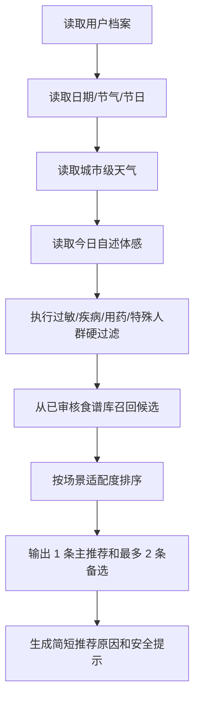

# YunSync V3 轻量养生小程序改版计划书

> 产品方向：像万年历一样，每天打开即可获得简单、可信、可制作的当日食养建议
>
> 文档版本：V3.0 需求评审稿
>
> 更新日期：2026 年 9 月 28 日
>
> 目标载体：微信小程序优先，现有 FastAPI 后端继续复用
>
> 当前状态：待确认产品范围、视觉原型、天气数据源和专业内容审核人员

---

## 1. 改版结论

当前 V2 以“体检报告—指标确认—安全分流—周方案—执行反馈—复查”为主线，工程能力完整，但首次使用步骤多、页面多、概念多，不适合作为高频打开的轻量养生小程序。

V3 将产品主线调整为：

```text
今天是什么日子、天气怎么样
    + 我的体感与基础情况
    + 我所在的地域和饮食偏好
    + 我手头现有的食材
    -> 今天适合吃什么
    -> 为什么推荐
    -> 需要哪些食材
    -> 怎么制作
```

用户每天打开首页，应在 5 秒内看见一条主要推荐，在 30 秒内决定“今天做什么”。

### 1.1 一句话产品定义

YunSync 是一款结合日期节气、天气、地域、个人体感和现有食材，为普通成年人提供日常食养食谱与制作方法的轻量养生小程序。

### 1.2 本次改版原则

1. 首页先给答案，再解释原因。
2. 首屏只保留一条主推荐和最多两条备选。
3. 常用功能不超过三项，底部导航不超过三个。
4. 首次资料填写控制在 60—90 秒，其他信息按需补充。
5. 推荐来自审核食谱库，AI 只负责理解用户表达和组织文字，不自由编造食材、剂量或功效。
6. “感冒、上火、湿气”等输入只作为用户自述状态，不作为医学诊断。
7. 高风险症状、过敏、特殊人群和明确医疗限制优先触发安全提示。

---

## 2. 目标用户与核心场景

### 2.1 目标用户

- 希望每天获得简单饮食建议的普通成年人；
- 关注节气、传统节日和地域饮食习惯的人群；
- 不知道现有食材能做什么的家庭做饭人群；
- 希望根据天气和近期体感调整日常饮食的人群；
- 为家人准备粥、汤、家常菜和节日食品的家庭健康管理者。

### 2.2 四个高频场景

| 场景 | 用户表达 | 产品结果 |
|---|---|---|
| 每日推荐 | “今天吃什么比较合适？” | 根据日期、天气、地域和个人档案给出 1 主 2 备选 |
| 节日节气 | “今天是腊八节。” | 展示腊八粥、腊八蒜等文化食谱及完整做法 |
| 近期体感 | “最近着凉了，胃口也不好。” | 在安全筛查后推荐温热、清淡、易消化的审核食谱，不宣称治疗感冒 |
| 现有食材 | “我有鸡蛋、西红柿、豆腐。” | 匹配能完成的菜品，标出缺少材料和可审核替代项 |

### 2.3 首版服务边界

- 服务成年人日常饮食教育和生活方式支持；
- 不诊断体质、疾病或证候；体质结果只作为经审核问卷形成的生活方式参考；
- 不提供治疗、处方、药物调整或替代就医建议；
- 不因天气、节气或单次体感声称某种食物具有确定疗效；
- 儿童、孕哺期、严重慢病、肿瘤治疗期、透析、进食障碍等人群不进入自动个体化推荐；
- 高热、呼吸困难、胸痛、意识异常、持续呕吐、明显脱水或症状持续加重时停止推荐并提示及时就医。

---

## 3. 简化后的信息架构

### 3.1 底部导航

首版只保留三个入口：

| 导航 | 主要任务 | 页面内容 |
|---|---|---|
| 今日 | 今天吃什么 | 日期、天气、节气/节日、体感入口、主推荐和备选 |
| 食材 | 手头食材做什么 | 食材输入、匹配结果、缺少材料、替代建议 |
| 我的 | 管理个人情况 | 体质参考、过敏禁忌、地域、口味、收藏和隐私设置 |

### 3.2 从主界面移出的功能

下列现有能力不再占据底部导航和首页首屏：

- 体检报告上传与 OCR；
- 指标趋势和跨报告对比；
- 七天周计划和复杂采购清单；
- 执行反馈、复查提醒和方案版本；
- 旧版行动、实验与结果页；
- 内容审核和运维管理页面。

处理方式：后台能力和数据不立即删除。体检报告放入“我的 > 健康资料（高级功能）”，管理端保持独立入口，旧实验页面仅保留历史兼容，不参与小程序主流程。

### 3.3 首页线框

```text
┌──────────────────────────────┐
│  九月初八 · 周一      杭州 ▾ │
│  18℃ 小雨  偏凉      白露后  │
├──────────────────────────────┤
│  今天感觉怎么样？             │
│  [正常] [有点着凉] [胃口差]   │
│  [睡不好] [口干] [其他]       │
├──────────────────────────────┤
│  今日推荐                     │
│  山药小米粥                   │
│  暖食 · 清淡 · 约 30 分钟     │
│  [看食材和做法]               │
├──────────────────────────────┤
│  还可以做                     │
│  番茄豆腐汤    清炒时蔬        │
├──────────────────────────────┤
│  为什么推荐？ 天气偏凉/体感选择 │
│  日常饮食建议，不替代诊疗      │
└──────────────────────────────┘
       今日        食材        我的
```

### 3.4 页面复杂度限制

- 一个页面最多一个主按钮；
- 首页首屏不出现表格、趋势图、专业指标代码和版本号；
- 首页同时展示的完整食谱卡不超过三张；
- 表单默认一次只问一个主题，支持跳过非安全必填项；
- 推荐原因默认显示 2—4 个短标签，详细依据折叠；
- 食谱步骤每步只描述一个动作，默认 4—8 步；
- 专业来源、审核版本和完整禁忌放在详情页底部。

---

## 4. P0 核心功能

### 4.1 轻量个人档案

首次进入只收集：

1. 城市或地域，可手动选择；
2. 年龄段；
3. 已知过敏；
4. 明确疾病、用药或医生饮食限制；
5. 饮食偏好和忌口；
6. 是否愿意完成体质参考问卷。

体质参考采用经专业审核的结构化问卷。结果使用“偏寒感受较多”“近期易燥”等谨慎表述，不使用“确诊某体质”或“治疗某证候”。用户不填写时使用通用季节食谱，不阻断使用。

### 4.2 今日天气与日历上下文

系统获取或计算：

- 公历日期、星期；
- 农历日期；
- 二十四节气；
- 传统节日和地区性节庆；
- 用户选择城市的温度、体感温度、湿度、降水和昼夜温差；
- 季节和地域食材可得性标签。

定位默认使用城市级信息。拒绝定位后允许手动选择城市，不采集持续精确位置。

### 4.3 今日食养推荐

推荐顺序：



建议排序维度：

| 维度 | 作用 | 说明 |
|---|---|---|
| 安全约束 | 硬过滤 | 过敏、疾病、用药、医生限制命中即排除 |
| 今日体感 | 主要匹配 | 只使用审核标签，不根据自由文本自行推断疾病 |
| 天气与季节 | 主要匹配 | 使用温度、湿度、降水和温差标签 |
| 体质参考 | 辅助匹配 | 无结果时不影响通用推荐 |
| 节日节气 | 场景加权 | 节庆食谱须同时通过个人安全过滤 |
| 地域与口味 | 辅助排序 | 优先本地常见、容易购买和符合口味的食谱 |
| 最近推荐 | 去重复 | 避免连续多日展示同一道主推荐 |

推荐结果必须说明“因为哪些已知条件被选中”，不得生成医学因果结论。

### 4.4 节气与节日内容

建立可审核的 `FestivalContentBundle`：

- 日期规则；
- 节日/节气名称和文化说明；
- 推荐食谱集合；
- 地域适用范围；
- 食材、克数、步骤和制作时间；
- 过敏原、禁忌和替代材料；
- 来源、审核人、版本和有效期。

腊八节验收示例：

- 首页主卡可展示腊八粥；
- 备选卡可展示腊八蒜；
- 用户对蒜不耐受时不展示腊八蒜；
- 腊八粥材料根据过敏和现有食材做安全替换；
- 文案描述节日饮食文化，不宣称防病或治病。

### 4.5 今日体感快速选择

P0 使用固定选项：

- 正常；
- 有点着凉；
- 胃口较差；
- 睡眠不足；
- 口干；
- 排便不规律；
- 其他轻微不适。

选择后先展示安全问题。用户输入“感冒”时，系统可以理解为自述的轻微感冒样不适，但输出只能是补水、清淡、易吞咽、易消化等日常饮食建议。出现高风险描述时不继续食谱个性化。

### 4.6 手头食材做什么

用户可通过搜索和常用标签录入 1—15 种食材，并选择：

- 主食、蔬菜、肉蛋奶、豆制品、调味品；
- 可接受的制作时间；
- 厨具；
- 一人食或家庭份数；
- 是否接受再购买 1—2 种材料。

匹配规则：

1. 先执行个人安全过滤；
2. 只从审核通过的食谱模板匹配；
3. 完全具备材料的食谱优先；
4. 缺少不超过两种非关键材料时允许展示，并明确列出；
5. 替代材料必须来自模板中已审核的替代关系；
6. 没有安全匹配时说明原因，不让 AI 临时拼出未经审核的配方。

### 4.7 食谱详情

每个正式食谱必须包含：

- 食谱名称和类别：菜、饭、粥、汤、饮品或节庆食品；
- 适用人数；
- 食材名称、用量和前处理；
- 预计时间和所需厨具；
- 分步骤制作方法；
- 可选替代材料；
- 过敏原和不适用情况；
- 推荐场景标签；
- 来源、审核信息和内容版本；
- “日常饮食建议，不替代诊疗”提示。

---

## 5. 功能优先级

### 5.1 P0：首版必须完成

- 三栏底部导航和全新今日首页；
- 城市级天气、日历、农历、节气和传统节日上下文；
- 轻量个人档案、过敏和限制条件；
- 固定体感选项及高风险阻断；
- 每日 1 主 2 备选食谱；
- 食材反查食谱；
- 完整食谱详情；
- 内容审核、发布、停用和回滚；
- 收藏和最近浏览的最小能力；
- 无定位、无天气、无匹配结果时的降级方案。

### 5.2 P1：首版稳定后增加

- 每日提醒；
- 家庭成员档案；
- 一周不重复推荐；
- 菜单分享和采购清单；
- 语音输入现有食材；
- 用户对口味、难度和耗时的反馈；
- 地区时令食材专题；
- 体检报告作为高级个性化输入。

### 5.3 P2：暂不开发

- 自动诊断中医体质或疾病；
- 根据症状生成治疗方案；
- AI 自由生成未审核食谱；
- 复杂周计划、实验、统计图表和长周期随访作为默认流程；
- 精确定位、持续后台定位；
- 电商购买、在线问诊和药品推荐；
- 面向儿童、孕哺期或复杂慢病的自动个体化方案。

---

## 6. 数据与接口改造

### 6.1 新增或调整的数据对象

| 对象 | 关键字段 | 用途 |
|---|---|---|
| `WellnessProfile` | 城市、年龄段、体质参考、偏好、禁忌 | 轻量个人档案 |
| `DailyCheckIn` | 日期、固定体感、自由补充、风险结果 | 当日状态 |
| `WeatherSnapshot` | 城市、温湿度、降水、温差、采集时间 | 可复现天气依据 |
| `CalendarContext` | 公历、农历、节气、节日、地域 | 日历场景 |
| `FestivalContentBundle` | 日期规则、地域、食谱、来源、版本 | 节庆内容 |
| `RecipeTemplate` | 类别、食材、步骤、标签、禁忌、审核状态 | 食谱主数据 |
| `PantrySession` | 用户输入食材、厨具、份数、耗时 | 食材匹配请求 |
| `DailyRecommendation` | 输入摘要、候选、排序原因、内容版本 | 推荐留痕与去重复 |

健康数据、天气和推荐日志均遵循最小化保存。天气快照保存城市级环境信息，不保存精确轨迹。

### 6.2 建议 API

```text
GET    /api/v1/today/context
PUT    /api/v1/wellness-profile
GET    /api/v1/wellness-profile
POST   /api/v1/daily-check-ins
POST   /api/v1/recommendations/today
GET    /api/v1/recipes/{recipe_id}
POST   /api/v1/pantry/matches
POST   /api/v1/recipes/{recipe_id}/favorite
DELETE /api/v1/recipes/{recipe_id}/favorite
GET    /api/v1/favorites
```

天气提供方、农历算法和推荐引擎通过适配器隔离，第三方不可用时回退到季节通用内容和用户手动城市。

---

## 7. 技术方案

### 7.1 客户端

建议新建 `miniapp/`，使用 uni-app、Vue 3 和 TypeScript，以便复用现有 Vue 经验并输出微信小程序。现有 `frontend/` 保留为管理端、演示站和高级功能入口。

### 7.2 服务端复用

继续复用：

- FastAPI、SQLAlchemy 和 Alembic；
- 账号、授权、隐私数据导出和删除；
- 食材、食谱、禁忌、来源和内容版本；
- 安全规则、审计、限流、监控、CI 和发布工具；
- 收藏、推荐和天气所需的新 API 在现有分层架构中增加。

### 7.3 推荐实现

P0 使用“硬规则过滤 + 审核标签匹配 + 可解释排序”，不使用大模型直接决定食谱。大模型只在以下场景使用：

- 将用户自由输入归入固定体感或食材候选，低置信时要求确认；
- 将结构化推荐原因改写成简短易懂的文案；
- 任何输出再次通过食材白名单、功效禁语和安全扫描。

---

## 8. 现有系统迁移策略

| 现有能力 | V3 处理方式 |
|---|---|
| 食材、食谱、禁忌和内容审核 | 直接复用数据结构，重新审核面向每日推荐的标签和文案 |
| 风险分流与过敏限制 | 简化输入，继续作为推荐前硬门禁 |
| 体检报告和趋势 | 移到“我的 > 高级健康资料”，不进入 P0 首页 |
| 周方案、反馈和复查 | 保留后端和历史数据，退出默认导航 |
| 旧行动、实验和结果 | 继续归档兼容，不在小程序开放 |
| 管理端 | 使用现有 Web 管理端，不搬入小程序 |
| 隐私、删除、审计和运维 | 继续复用并增加天气、体感和推荐日志的数据说明 |

上线时通过产品模式配置启用 V3 首页，先隐藏复杂路由，不直接删除旧数据和接口。完成数据迁移、用户验证和回滚演练后再决定旧页面归档范围。

---

## 9. 里程碑与开发排期

### M0：需求冻结与原型（3—5 天）

- 确认微信小程序为首发平台；
- 确认三栏导航和首页线框；
- 确认体质参考问卷的来源和审核方式；
- 确认天气数据源、地域粒度和隐私文案；
- 用腊八节、轻微着凉、现有食材三个案例完成可点击原型。

**验收：** 5 名非项目成员能在 30 秒内找到“今天吃什么”和“现有食材做什么”。

### M1：小程序框架与简化首页（1 周）

- 建立 `miniapp/` 工程和三栏导航；
- 完成今日首页、空状态、加载和异常状态；
- 接入城市选择、基础日期和天气适配器；
- 建立简化档案和本地缓存。

**验收：** 无登录演示数据下可完整展示首页；天气不可用时正常降级。

### M2：日历、节气、节日与内容库（1 周）

- 接入农历、节气和传统节日；
- 建立节庆内容包和地域标签；
- 完成腊八、春节、端午、中秋及 4 个节气示例；
- 补齐粥、汤、家常菜和节庆食品字段。

**验收：** 日期命中正确，节庆内容通过安全过滤，食谱字段完整率 100%。

### M3：个人情况与今日推荐（1 周）

- 完成轻量档案、体质参考和今日体感；
- 完成高风险阻断与过敏硬过滤；
- 实现 1 主 2 备选和推荐原因；
- 完成推荐去重复与降级。

**验收：** 安全冲突拦截率 100%，首页返回不超过三条推荐。

### M4：现有食材生成菜谱（1 周）

- 完成食材搜索、常用标签、份数、厨具和时间条件；
- 实现完全匹配、缺料匹配和审核替代；
- 完成无结果解释和可购买少量材料模式。

**验收：** 10 组常见家庭食材均能得到明确结果或可理解的无结果原因。

### M5：体验收口与内容审核（1 周）

- 完成收藏、最近浏览和简单反馈；
- 完成内容审核、版本和停用影响；
- 统一养生文案、安全提示和隐私说明；
- 完成性能、弱网、权限和小程序兼容测试。

**验收：** P0/P1 缺陷为 0，核心任务完成率不低于 90%。

### M6：试用与发布（1 周）

- 先进行 3—5 人走查，再进行 10—20 人封闭试用；
- 修复主要困惑点和高频无匹配场景；
- 完成正式内容签署、天气服务配置和发布检查；
- 准备演示视频、用户手册和回滚方案。

**验收：** 专业内容、安全、隐私、真实用户和发布负责人共同签署。

---

## 10. 核心验收用例

| 编号 | 用例 | 期望结果 |
|---|---|---|
| V3-01 | 腊八节打开首页 | 主推荐包含审核后的腊八节食谱，展示文化说明、食材和步骤 |
| V3-02 | 用户对蒜不耐受 | 不展示腊八蒜，给出安全备选 |
| V3-03 | 用户自述轻微着凉 | 推荐清淡温热的审核食谱，不出现“治疗感冒”等文案 |
| V3-04 | 用户输入高热、胸痛或呼吸困难 | 停止食谱个性化，明确提示及时就医 |
| V3-05 | 杭州小雨偏凉 | 推荐原因可显示天气偏凉和降水标签 |
| V3-06 | 拒绝定位 | 可手动选城市并继续使用 |
| V3-07 | 输入鸡蛋、西红柿、豆腐 | 返回可制作菜品，准确标注已有和缺少材料 |
| V3-08 | 食材命中过敏 | 冲突食谱完全排除，不只显示警告 |
| V3-09 | 无完全匹配食谱 | 展示缺少不超过两种材料的候选或明确无结果原因 |
| V3-10 | 天气服务不可用 | 使用城市季节通用内容，不显示伪造的实时天气 |

---

## 11. 成功指标

### 11.1 易用性

- 返回用户打开首页到看见主推荐不超过 3 秒；
- 首次用户完成基础设置并看到推荐不超过 90 秒；
- “今天吃什么”和“现有食材做什么”任务完成率不低于 90%；
- 首页首屏主操作点击率和食谱详情到达率可被匿名聚合统计。

### 11.2 内容与安全

- 过敏、明确禁忌和特殊人群冲突拦截率 100%；
- 正式食谱材料和步骤完整率 100%；
- 正式推荐均可追溯到食谱版本、规则版本和输入摘要；
- 未审核内容进入正式推荐的数量为 0；
- 治疗承诺、诊断和调药建议出现数量为 0。

### 11.3 工程

- 已缓存上下文下推荐接口 P95 小于 500 ms；
- 需要刷新天气时整体 P95 小于 1.5 秒；
- 天气、日历或 AI 服务单独失败时核心食谱浏览仍可用；
- 小程序首包和分包大小满足平台发布限制；
- P0/P1 缺陷为 0 后才进入公开试用。

---

## 12. 开发前必须确认的事项

1. 是否确定微信小程序为首发平台；
2. 产品名称是否继续使用“云循”；
3. 首页是否固定采用“1 主推荐 + 2 备选”；
4. 体质参考采用哪套经授权、经专业审核的问卷；
5. 首批支持哪些城市和地域标签；
6. 首批节日、节气和食谱各需要多少条；
7. 天气数据源、调用预算、缓存时间和故障降级方式；
8. 是否保留体检报告作为“我的”中的高级功能；
9. 谁负责营养、中医药、法规、安全和最终内容签署；
10. 小程序正式身份、隐私告知、定位授权和数据删除流程。

上述事项冻结后再进入 M1 开发，避免继续在复杂旧界面上叠加功能。
