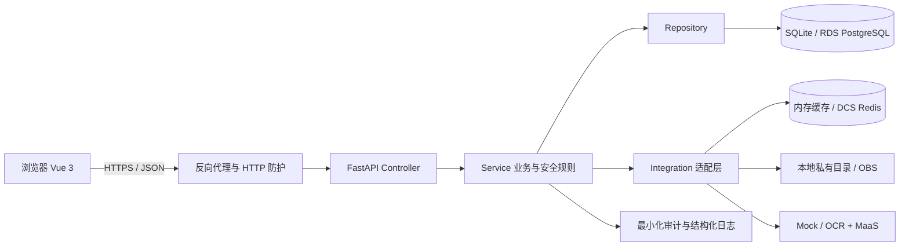

# YunSync 技术说明

> 版本：M12A 本地工程基线

## 1. 系统边界

云循由 Vue 单页应用和 FastAPI 服务组成。浏览器只保存短期会话和页面状态；授权、对象归属、安全初筛、报告状态、候选行动、随机日程、实验状态与统计结果均以后端为准。



当前可验证路径是 SQLite、内存缓存降级、本地私有对象目录和明确标注的 Mock。右侧云服务名称表示目标适配关系，不表示已经产生真实调用。

## 2. 代码分层

| 层 | 目录 | 职责 |
|---|---|---|
| 页面与组件 | `frontend/src/views`、`frontend/src/components` | 用户任务、响应式呈现和可访问状态 |
| 前端状态与请求 | `frontend/src/state`、`frontend/src/stores`、`frontend/src/services` | 会话、跨页状态、API 错误恢复 |
| HTTP 控制器 | `backend/app/controllers` | 路由、输入协议和状态码 |
| 业务服务 | `backend/app/services` | 报告、行动、实验、结果和安全规则 |
| 数据访问 | `backend/app/repositories` | SQLAlchemy 查询与对象归属范围 |
| 模型与协议 | `backend/app/models`、`backend/app/schemas` | 持久化约束和输入输出契约 |
| 外部适配 | `backend/app/integrations` | 缓存、OBS、OCR、MaaS 和降级 |
| 配置与防护 | `backend/app/core` | 环境门禁、认证、HTTP 安全和日志 |
| 迁移与种子 | `backend/alembic`、`backend/app/db` | 可追踪数据库演进和合成数据初始化 |

## 3. 关键状态与不变量

### 报告

上传先校验大小、扩展名、MIME 和文件签名，再进入私有存储与 OCR。OCR 失败或返回重复标准代码时不写入指标；数据库同时以“报告 + 指标代码”唯一索引兜底。全部字段逐项确认或修正后，报告才能进入 `confirmed`，候选行动排序才会读取它。

### 实验

实验状态为 `active`、`paused`、`terminated`、`completed`。终止和完成不可恢复；完成要求周期结束且 14 个日期都有记录。随机日程固定为 14 天、7:7 分组，并通过摘要防篡改。

### 结果

结果计算包含有效天数、缺失、异常值策略、组均值/中位数、差值和 Bootstrap 区间。数据不足时不输出方向性健康结论；AI 只解释服务端计算结果，输出需通过禁用诊断、调药、保证疗效等规则。个人实验可导出为带版本、生成时间和边界声明的私有 JSON 附件。

## 4. 身份、权限与数据最小化

- 演示账号换取随机短期令牌，数据库只保存 SHA-256 摘要；
- 健康接口需要当前版本授权、参与者角色和对象归属；
- 审核角色只能读取最小化审计事件，不能读取参与者健康页面；
- 撤回授权立即阻断新分析并暂停活动实验；
- Production 启动门禁禁止演示登录、演示种子、SQLite、本地对象存储和 Mock AI。

## 5. 可观测性与 HTTP 防护

每个响应携带 `X-Request-ID`。日志记录请求方法、路径、状态和耗时，不记录健康正文或凭据。服务提供 `/healthz` 和 `/readyz`；缓存不可用时后者报告 `memory_fallback`，核心数据库流程继续运行。

生产配置要求精确 CORS、Host 白名单、可信代理、HTTPS、API 文档关闭和限流。响应包含 CSP、内容类型保护、Referrer Policy 等安全头；健康 API 使用 `no-store`。

## 6. 构建、验证与发布

Windows 全量验证：

```powershell
.\scripts\verify.ps1
.\.venv\Scripts\python.exe scripts\repository_security_scan.py
.\.venv\Scripts\python.exe scripts\rc1_acceptance.py --rounds 3
.\.venv\Scripts\python.exe scripts\materials_check.py --json
```

Linux 使用 `scripts/verify.sh`。生产构建由多阶段 Dockerfile 生成前端静态资源和后端运行层；Compose 示例使用非 root、只读根文件系统、`no-new-privileges` 和 capabilities 清理。真实镜像仍需在可用容器环境构建与扫描。

## 7. 性能策略

- 用户最近实验、最近报告和报告指标使用组合索引；
- PostgreSQL 使用有界连接池、`pool_pre_ping` 和连接回收；
- Vue 运行时与 ECharts 拆成独立缓存块；
- 非健康模板解释可进入 Redis/内存 TTL 缓存，读取后再次执行安全守卫；
- 慢请求以结构化事件记录，真实阈值需在 RDS/DCS 与公网条件下复核。

## 8. 云迁移与尚未验证项

| 本地/合成实现 | 目标云能力 | 当前状态 |
|---|---|---|
| SQLite | RDS PostgreSQL | 迁移 SQL 与配置门禁完成；真实空库迁移待验收 |
| 内存 TTL | DCS Redis | 故障降级完成；真实断连待验收 |
| 本地私有目录 | OBS 私有桶 | SDK 私有读写与契约测试完成；真实桶权限与生命周期待验收 |
| OCR Mock | 华为云 OCR | 契约与失败状态完成；真实准确率待验收 |
| MaaS Mock | 华为云 MaaS | 输出守卫完成；真实调用待验收 |
| 本地日志 | 云日志与告警 | 事件结构完成；送达与恢复待验收 |

更详细的设计决策见 [ARCHITECTURE.md](ARCHITECTURE.md)，部署安全基线见 [DEPLOYMENT_SECURITY_RUNBOOK.md](DEPLOYMENT_SECURITY_RUNBOOK.md)。
