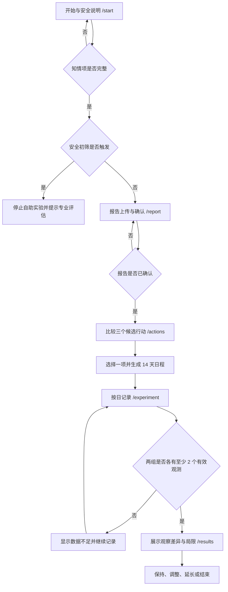

# YunSync 主流程与交互规格

> 版本：V0.1  
> 对应需求：[PRODUCT_REQUIREMENTS.md](PRODUCT_REQUIREMENTS.md)

## 1. 主流程

## 2. 页面状态矩阵

| 页面 | 初始/加载 | 空状态 | 错误状态 | 成功状态 | 安全状态 |
|---|---|---|---|---|---|
| `/start` | 勾选项为空、问题未回答 | 不适用 | 不适用 | 全部通过后可继续 | 任一“是”立即显示停止卡片 |
| `/report` | 加载最近报告 | 无报告时显示上传引导 | 格式、大小、接口错误 | 待确认或已确认 | 提醒勿上传真实身份信息 |
| `/actions` | 加载候选项 | 报告未确认时无候选项 | 接口错误 | 选中一项可生成计划 | 高风险时不返回候选项 |
| `/experiment` | 加载当前实验 | 无实验时引导返回候选行动 | 日期、分组或保存错误 | 保存后刷新进度 | 身体不适需停止流程（待后续实现） |
| `/results` | 加载结果 | 无实验时引导开始 | 接口错误 | 数据充足时显示差异 | 数据不足时禁止方向性结论 |

## 3. 关键交互规则

### 3.1 开始与安全说明

- 三项知情说明必须分别勾选，不能默认勾选。
- 四项安全问题必须逐项回答，不能用一个“全部正常”替代。
- 任一项为“是”时不提供绕过按钮。
- 本阶段答案仅保存在页面内存；刷新即清除，避免误认为已经建立真实授权记录。

### 3.2 报告确认

- 文件选择后再允许点击“解析报告”。
- Mock 结果必须在上传区、状态反馈和结果区明确标记“合成”。
- 正式 OCR 接入时，表格需增加“原文、置信度、确认/修改”列；低置信字段不得批量跳过。

### 3.3 行动选择

- 默认可聚焦第一项，但只有用户主动点击“生成计划”才创建实验。
- 每项展示行动说明、主要指标、依据摘要、安全条件和排序分。
- 排序分只表示当前规则下的适配度，不等于成功率或治疗概率。

### 3.4 实验与每日记录

- 未来日期不可选择；服务端是分组事实的唯一来源。
- 表单随行动类型动态切换主要指标。
- 保存成功后重新拉取实验，避免仅靠前端乐观状态掩盖失败。
- 缺失原因、身体不适、计划外事件和停止流程在第 7 周实现。

### 3.5 结果评估

- 首屏同时出现“观察差异”和数据量，避免只展示一个醒目数字。
- 数据不足时使用中性提示，不写“改善”“有效”“更好”等方向性词语。
- 固定展示不可推断内容和混杂因素列表。

## 4. 响应式与可访问性

- 桌面端采用侧栏导航；移动端使用底部导航，关键操作靠近拇指可达区域。
- 320 px 至 680 px 下，双栏页面折叠为单栏，安全问题的答案按钮独占一行。
- 所有输入均使用原生 `label`、`fieldset`、`legend` 或等效可访问名称。
- 拦截、错误和成功状态同时使用文字与图标，不单独依赖红、绿颜色。
- 禁用按钮附近给出未满足条件，避免用户只看到不可点击状态。

## 5. 原型边界

当前 `/start` 是交互原型，不构成正式授权记录，也不会持久化安全问卷。正式实现必须由后端保存授权版本、时间、撤回状态和审计事件，并在所有报告与实验接口再次校验授权状态。

