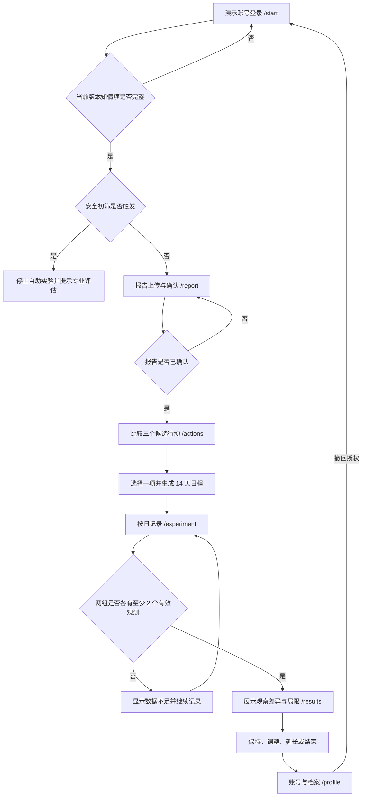

# YunSync 主流程与交互规格

> 版本：V0.3
>
> 对应需求：[PRODUCT_REQUIREMENTS.md](PRODUCT_REQUIREMENTS.md)

## 1. 主流程

## 2. 页面状态矩阵

| 页面 | 初始/加载 | 空状态 | 错误状态 | 成功状态 | 安全状态 |
|---|---|---|---|---|---|
| `/start` | 读取演示会话与授权状态 | 未登录时显示登录入口 | 登录、授权或保存失败 | 登录、授权、初筛通过后可继续 | 任一“是”保存后停止自助流程 |
| `/report` | 加载最近报告 | 无报告时显示上传引导 | 格式、大小、接口错误 | 待确认或已确认 | 提醒勿上传真实身份信息 |
| `/actions` | 加载候选项 | 报告未确认时无候选项 | 接口错误 | 选中一项可生成计划 | 高风险时不返回候选项 |
| `/experiment` | 加载当前实验、记录详情与提醒设置 | 无实验时引导返回候选行动 | 日期、指标、分组、状态、导入或日程完整性错误 | 保存或导入后刷新进度并回填记录 | 暂停/终止时锁定记录；明显不适自动暂停 |
| `/results` | 加载结果 | 无实验时引导开始 | 接口错误 | 数据充足时显示差异 | 数据不足时禁止方向性结论 |
| `/profile` | 读取合成档案 | 不适用 | 会话、授权或保存失败 | 保存档案并更新账号状态 | 可撤回授权并暂停实验 |

## 3. 关键交互规则

### 3.1 开始与安全说明

- 三项知情说明必须分别勾选，不能默认勾选。
- 四项安全问题必须逐项回答，不能用一个“全部正常”替代。
- 任一项为“是”时不提供绕过按钮。
- 未登录时不能提交授权或初筛；登录使用不采集真实身份的短期演示会话。
- 授权版本、接受/撤回时间和初筛答案保存到合成演示数据库。前端守卫只改善导航体验，后端在每个健康接口再次校验。
- 刷新后从后端恢复活动授权与初筛结果；未完成、已撤回或触发初筛时，健康接口分别返回 403 或 409。

### 3.2 报告确认

- 文件选择后再允许点击“解析报告”。
- Mock 结果必须在上传区、状态反馈和结果区明确标记“合成”。
- 扩展名、MIME 和文件签名必须一致；源文件保存在非公开目录，只能由所属参与者通过鉴权接口取回。
- 表格展示原文、置信度、页码、归一化位置、确认和修改；低于 80% 的字段突出显示。
- 每个字段必须选择“确认原值”或保存修正；全部字段处理前，“完成报告确认”不可用。
- OCR 失败状态不包含候选指标，并提供基于已保存源文件的人工重试入口。

### 3.3 行动选择

- 默认可聚焦第一项，但只有用户主动点击“生成计划”才创建实验。
- 每项展示行动说明、主要指标、依据摘要、适用条件、安全条件、模板版本和审核范围。
- 排序分固定展示依据 40%、短期可观察性 35%、易执行性 25% 的权重与各项得分贡献，只表示当前规则下的适配度。
- 原型模板显示“产品规则校验（待专业复核）”，不得缩写为“专业审核通过”。
- 受控解释同时显示来源和策略版本；模型输出被守卫拒绝时改用 `policy_fallback` 固定解释。
- 只有活动、低风险且审核状态符合当前环境的模板可以被选择；新版本启用后，同代码旧版本自动停用，但已有实验仍保留原模板引用。

### 3.4 实验与每日记录

- 未来日期不可选择；服务端是分组事实的唯一来源。
- 创建实验即进入 `active`；新建时暂停既有活动实验，数据库部分唯一索引再次保证每名用户最多一个 `active` 实验。
- 日程固定为 14 天 7:7，随机种子、日程版本、锁定时间和 SHA-256 摘要入库；服务端在读取、记录和状态变化前重新校验。
- 状态机允许进行中暂停、终止或在满足条件时完成，暂停后可恢复；终止和完成不可恢复。
- 完成操作要求已到第 14 天且 14 个日期均有记录；“已记录天数”和“行动完成天数”分开显示。
- 表单随行动类型动态切换主要指标。
- 保存成功后重新拉取实验，避免仅靠前端乐观状态掩盖失败。
- 每个日程日返回已有记录详情，用户选择已记录日期时回填表单；主要指标随饭后活动、饮料替换或进食顺序动态切换。
- 主要指标为空时必须选择缺失原因；身体不适和计划外事件独立记录，明显不适保存后由服务端自动暂停实验。
- 提醒开关和时间保存在合成档案中；当前仅提供页面打开时的应用内提醒，不声称具备系统级推送。
- CSV/JSON 模板由当前实验行动生成；导入先整批校验再提交，同一天重复导入更新原记录。
- 缺失原因、身体不适、计划外事件和停止流程在第 7 周实现。

### 3.5 结果评估

- 首屏同时出现“观察差异”和数据量，避免只展示一个醒目数字。
- 数据不足时使用中性提示，不写“改善”“有效”“更好”等方向性词语。
- 固定展示不可推断内容和混杂因素列表。

### 3.6 账号与档案

- 参与者可编辑显示名称、年龄范围、行为目标、作息、活动基础、限制条件和记录偏好；页面持续提示只填合成内容。
- 撤回授权需要明确确认，成功后回到 `/start`；服务端暂停活动实验并拒绝新的健康数据操作。
- 注销吊销当前会话并清除浏览器会话存储，不影响审计记录。
- 审核角色仅通过受保护 API 读取最小化审计事件，不显示参与者健康档案。

## 4. 响应式与可访问性

- 桌面端采用侧栏导航；移动端使用底部导航，关键操作靠近拇指可达区域。
- 320 px 至 680 px 下，双栏页面折叠为单栏，安全问题的答案按钮独占一行。
- 所有输入均使用原生 `label`、`fieldset`、`legend` 或等效可访问名称。
- 拦截、错误和成功状态同时使用文字与图标，不单独依赖红、绿颜色。
- 禁用按钮附近给出未满足条件，避免用户只看到不可点击状态。

## 5. 原型边界

当前账号、授权与档案仍是合成数据演示实现，不接入手机号、邮箱、真实验证码或外部身份提供方。Production 强制关闭演示登录；正式身份渠道需在部署和账号体系确定后单独设计。现有后端会话、角色、授权与对象归属校验用于验证安全闭环，但不应包装为正式生产身份系统。
